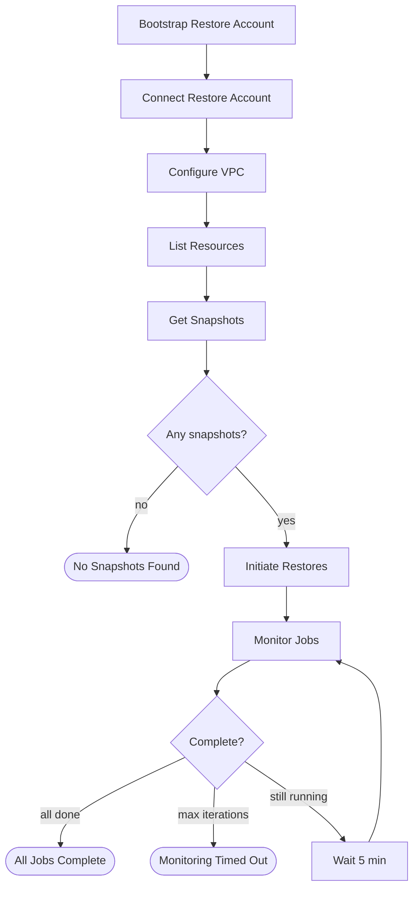

# Eon Bulk Recovery Application

Automated disaster recovery application for AWS resources backed up by Eon. Uses AWS Step Functions to orchestrate complete multi-region restore workflows.



Every task state also catches its own failure into a dedicated terminal state
(`Bootstrap Failed`, `Connect Account Failed`, and so on), omitted above for readability.

## Quick Start

### Prerequisites

**Eon Requirements:**
- Eon account with API credentials (Client ID and Secret)
- Project ID and Account ID

**AWS Requirements:**
- AWS CLI and SAM CLI installed (`pip install aws-sam-cli`)
- IAM permissions to deploy CloudFormation stacks
- Restore account with cross-account access (see below)

### Cross-Account Setup

Choose one option based on your AWS setup:

#### Option A: AWS Organizations (Recommended)

1. Deploy the main application with `ManagementAccountId` parameter
2. Deploy the chain role in your management account:

```bash
aws cloudformation deploy \
  --template-file management-account-role.yaml \
  --stack-name eon-bulk-recovery-chain-role \
  --parameter-overrides BackupAccountId=<YOUR_BACKUP_ACCOUNT_ID> \
  --capabilities CAPABILITY_NAMED_IAM \
  --region us-east-1
```

This enables automatic role chaining: Lambda → Chain Role → OrganizationAccountAccessRole

#### Option B: Least-Privilege Cross-Account Role

For non-Organization accounts — or Organization accounts that don't want the
application using the admin `OrganizationAccountAccessRole` — deploy
`cross-account-role.yaml` in each restore account. It creates a scoped role
trusting only the bulk recovery Lambda, with exactly the permissions the
workflow exercises in the restore account.

```bash
aws cloudformation deploy \
  --template-file cross-account-role.yaml \
  --stack-name eon-bulk-recovery-cross-account-role \
  --parameter-overrides BackupAccountId=<YOUR_BACKUP_ACCOUNT_ID> \
  --capabilities CAPABILITY_NAMED_IAM \
  --region us-east-1
```

Then pass the stack's `CrossAccountRoleArn` output as the `crossAccountRoleArn`
field in the execution input. Optional parameters: `CrossAccountRoleName`,
`LambdaExecutionRoleName` (default `EonBulkRecoveryLambdaRole`), and
`PermissionsBoundaryArn` (for orgs that mandate a boundary).

**What it grants:** CloudFormation (deploy Eon's `restore-account.yml`, list
recovery-stack resources), IAM scoped to `EonRestore*` (the bootstrap stack
creates those roles/policies/instance profile — including `iam:PassRole`, which
AWS requires to attach the node role to its instance profile), KMS (per-region
keys + aliases),
RDS (subnet groups + instance-class availability), S3 (create destination
buckets, read recovery-bucket tags), EC2 (`DescribeInstanceTypeOfferings`), and
DynamoDB (`DescribeTable`, `UpdateTable`, `TagResource`, `UntagResource`,
`ListTagsOfResource` for in-place WCU scaling).

The role does **not** carry data-plane restore permissions (`ec2:RunInstances`,
`rds:RestoreDB*`, S3/DynamoDB writes). Those belong to Eon's `EonRestoreAccountRole` /
`EonRestoreNodeRole`, which the bootstrap stack creates.

> **IAM scope note:** the `EonRestore*` grant lets this role create IAM principals
> via the bootstrap stack — the broadest permission in the template. It is scoped
> by name prefix (not exact names) so it keeps working as Eon evolves
> `restore-account.yml`, which is fetched as "latest" at bootstrap time.

#### Option B at scale: deploy the role to every account via StackSet

To roll the cross-account role out to many restore accounts at once, deploy
`cross-account-role-stackset.yaml` **once** from your AWS Organizations management
account (or a registered CloudFormation StackSets delegated administrator). It
creates a service-managed StackSet that deploys the same role to every account in
the target OU(s) — and auto-deploys it to accounts added to those OUs later.

```bash
# One-time per org: enable trusted access between StackSets and Organizations
aws cloudformation activate-organizations-access

aws cloudformation deploy \
  --template-file cross-account-role-stackset.yaml \
  --stack-name eon-bulk-recovery-cross-account-role-stackset \
  --parameter-overrides \
      BackupAccountId=<YOUR_BACKUP_ACCOUNT_ID> \
      TargetOrganizationalUnitIds=<ou-xxxx-aaaa,ou-xxxx-bbbb> \
  --capabilities CAPABILITY_NAMED_IAM \
  --region us-east-1
```

The role lands in each account under the same name (`CrossAccountRoleName`,
default `EonBulkRecoveryCrossAccountRole`), so its ARN per account is
`arn:aws:iam::<account-id>:role/EonBulkRecoveryCrossAccountRole` — that's the
value for `crossAccountRoleArn` when restoring into that account.

Notes:
- The role only creates IAM (global), so the StackSet deploys to a single region
  (`HomeRegion`, default `us-east-1`). One region per account is correct — don't
  add more, or the role name collides.
- Service-managed StackSets do **not** deploy to the Organizations management
  account. If it's also a restore target, deploy `cross-account-role.yaml` there
  as a normal stack.
- `cross-account-role-stackset.yaml` embeds `cross-account-role.yaml` verbatim as
  the per-account template; keep the two in sync.

### Deploy the Application

```bash
sam build
sam deploy --guided --capabilities CAPABILITY_IAM CAPABILITY_NAMED_IAM
```

**Parameters:**
- `EonAccountDomain` - Your Eon domain (e.g., `mycompany`)
- `EonProjectId` - Eon project ID (UUID)
- `EonAccountId` - Eon account ID
- `EonClientId` / `EonClientSecret` - API credentials
- `ManagementAccountId` - (Optional) For AWS Organizations
- `NotificationEmail` - (Optional) For completion alerts

## Usage

### Execute a Restore

**Via AWS Console:**
1. Go to Step Functions → `eon-bulk-recovery-workflow` → **Start Execution**

**Via AWS CLI:**
```bash
aws stepfunctions start-execution \
  --state-machine-arn <STATE_MACHINE_ARN> \
  --input file://execution-input.json
```

### Execution Input

**Minimal example (AWS Organizations):**

> **Important:** All fields must be present in the execution input — Step Functions will fail at runtime if any key referenced in the state machine is missing. Use `null`, `[]`, or `false` for unused optional fields.

```json
{
  "sourceAccountId": "333333333333",
  "restoreAccountId": "222222222222",
  "restoreRegion": null,
  "snapshotDate": "latest",
  "resourceTypes": [],
  "resourceIds": [],
  "resourceNamePrefix": null,
  "dynamodbRegionalWcuLimit": 40000,
  "crossAccountRoleArn": null,
  "excludeEC2TagKeys": [],
  "recoveryStackNames": [],
  "recoveryStacksOnly": false,
  "restoreAccountName": null,
  "vpcConfigs": [{
    "region": "us-east-1",
    "vpc": "vpc-xxx",
    "subnetsPerAvailabilityZone": [
      {"availabilityZone": "us-east-1a", "subnetId": "subnet-xxx"},
      {"availabilityZone": "us-east-1b", "subnetId": "subnet-yyy"}
    ],
    "securityGroups": {
      "restoreServer": ["sg-xxx"],
      "restoredRdsInstance": ["sg-yyy"]
    }
  }]
}
```

**Snapshot selection** — `snapshotDate` takes one of:

| Value | Behaviour |
|-------|-----------|
| `"latest"` or `null` | Restore each resource's most recent snapshot, whenever it was taken |
| `"2026-08-29"` | Restore only from snapshots taken on that day |

With a pinned date, any resource without a snapshot on that day is skipped and
listed in the completion notification under **Resources Without a Snapshot**. If
*no* resource in scope has a snapshot on that date, the workflow does not start
any jobs — it sends a `NO SNAPSHOTS FOUND` notification listing every affected
resource and terminates in the `No Snapshots Found` state.

**Scoping the run** — restrict which resources are restored:
```json
  "resourceTypes": ["AWS_DYNAMO_DB", "AWS_S3"],
  "resourceIds": ["i-0f600a1b15b035105", "1ee34dc5-0a7c-4e56-a820-917371e05c8d", "my-app-bucket"]
```
`resourceTypes` limits the run to the named Eon resource types (`AWS_EC2`,
`AWS_RDS`, `AWS_S3`, `AWS_DYNAMO_DB`); `[]` or omitted means all of them. An
unrecognised type fails the run at the `List Resources` step rather than quietly
restoring nothing.

`resourceIds` limits the run to specific resources. It accepts Eon resource IDs
(the UUIDs shown in the Eon console), cloud provider resource IDs (`i-…`, a
bucket or table name), or a mix — each is routed to the matching filter and the
results are unioned. Any ID that matches nothing is logged as a warning, so a
typo doesn't read as a resource with no backups. Both filters are applied
server-side by the Eon API, which also keeps the Step Functions payload under its
256 KB limit on large accounts.

**Tag exclusion** — add to the minimal example above:
```json
  "excludeEC2TagKeys": ["aws:autoscaling:groupName", "kubernetes.io/cluster/my-cluster"]
```
Tag keys matching this list will be filtered from restored EC2 instances and their volumes.

**Recovery stacks (in-place restore)** — add to the minimal example above:
```json
  "recoveryStackNames": ["OrdersServiceStack", "UserDataStack"]
```
The workflow queries the named CloudFormation stacks in the restore account for pre-created DynamoDB tables and S3 buckets. Both `AWS::DynamoDB::Table` and `AWS::DynamoDB::GlobalTable` count as tables — CDK's `TableV2` construct emits the latter, and a global table restores exactly like a regular one. For a global table the replica regions are read from `DescribeTable`, so it matches a source resource in any of its regions and the data is restored into the stack's own region (writes replicate from there). For DynamoDB, if a table matching the source table name AND source region is found, an **in-place restore** is performed instead of creating a new table — the table's WCU is temporarily scaled up (same allocation as new table restores) and restored to its original throughput after the restore completes. For S3, if a stack bucket has a tag (key = `s3InPlaceTagKey`, default `eon_functional_id`) matching the source bucket's tag value, an **in-place restore** is performed to that existing bucket.

**Stacks-only mode** — set both fields to only restore stack-matched resources:
```json
  "recoveryStackNames": ["OrdersServiceStack"],
  "recoveryStacksOnly": true
```
Skips EC2, RDS, and any DynamoDB/S3 resources that don't match a stack table or bucket.

**Example with custom resource name prefix:**
```json
{
  "sourceAccountId": "333333333333",
  "restoreAccountId": "222222222222",
  "resourceNamePrefix": "dr-",
  "vpcConfigs": [...]
}
```
Note: By default, resources are restored with their **original names** (designed for full account recovery to a new account). Set `resourceNamePrefix` to add a prefix (e.g., "dr-mydb" instead of "mydb").

### S3 Bucket Naming Limitations

S3 bucket names are **globally unique** across all AWS accounts worldwide. This means:

- **Original bucket names cannot be reused** - The source bucket still exists, so the same name is unavailable
- **A hash suffix is always added** - Restored buckets are named `{original-name}-{hash}` (e.g., `my-bucket-a1b2c3d4`)
- **The `resourceNamePrefix` still applies** - With a prefix, buckets become `{prefix}{original-name}-{hash}`
- **Long bucket names are truncated** - S3 limits names to 63 characters; when the combined name (original + hash suffix) exceeds 63 characters, the original name is truncated to preserve the hash suffix
- **AWS system tags are filtered** - Tags with reserved prefixes (`aws:`, `elasticbeanstalk:`) from the original bucket are automatically excluded as they cannot be manually recreated

**In-place restore:** When using `recoveryStackNames`, if a source S3 bucket has a tag matching `s3InPlaceTagKey` (default: `eon_functional_id`) and a recovery-stack bucket has the same tag value, the data is restored directly to the existing bucket. The tag value can be any string — the original bucket name, a hash, a UUID, etc. — it just needs to match between source and target. This avoids naming limitations and ensures the bucket name matches what the recovery stack's application code expects.

**Important:** Applications referencing S3 bucket names will need configuration updates after restore to point to the new bucket names. The restored bucket names are included in the workflow output and completion notification.

**Parameter reference:**

| Parameter | Required | Description |
|-----------|----------|-------------|
| `sourceAccountId` | Yes | Account with backed-up resources |
| `restoreAccountId` | Yes | Target account for restored resources |
| `restoreRegion` | No | Force all resources to this region (null = use source regions) |
| `snapshotDate` | No | `"latest"` / `null` for each resource's most recent snapshot, or `YYYY-MM-DD` to pin the run to one day |
| `resourceTypes` | No | Restrict the run to these Eon resource types: `AWS_EC2`, `AWS_RDS`, `AWS_S3`, `AWS_DYNAMO_DB` (default: `[]` = all) |
| `resourceIds` | No | Restrict the run to specific resources. Accepts Eon resource IDs (UUIDs), provider resource IDs (`i-…`, bucket/table names), or a mix (default: `[]` = all) |
| `resourceNamePrefix` | No | Prefix for restored resource names (null = use original names) |
| `dynamodbRegionalWcuLimit` | No | Total WCU budget per region across all tables (default: 40000). See [DynamoDB WCU Allocation](#dynamodb-wcu-allocation) |
| `dynamodbTableWcuMax` | No | Max WCU any single table can receive (default: 40000). Caps individual tables when the regional limit is raised |
| `vpcConfigs` | Yes | Network configuration per region (creates KMS keys and RDS subnet groups automatically) |
| `crossAccountRoleArn` | No | Custom role ARN or null for Organizations |
| `restoreAccountName` | No | Display name in Eon (null = auto-generate) |
| `excludeEC2TagKeys` | No | List of tag keys to exclude from restored EC2 instances and volumes (default: []) |
| `recoveryStackNames` | No | List of CloudFormation stack names to scan for pre-created DynamoDB tables and S3 buckets (default: []) |
| `recoveryStacksOnly` | No | When `true`, only restore resources that match a stack table/bucket — skip EC2, RDS, and unmatched DynamoDB/S3 (default: false) |
| `s3InPlaceTagKey` | No | Tag key used to match source and target S3 buckets for in-place restore (default: `"eon_functional_id"`). The tag value can be any string — bucket name, hash, UUID, etc. |

### DynamoDB WCU Allocation

When restoring DynamoDB tables, the workflow distributes Write Capacity Units (WCUs) across tables **per-region** to maximize restore throughput without exceeding account limits. This applies to both new table restores and in-place restores (recovery stack tables).

**How it works:**
1. Tables with known sizes (from Eon's resource inventory) are allocated first, proportionally to their size — a 10 GB table gets 10× the WCUs of a 1 GB table
2. 95% of the regional WCU limit is used (default: 38,000 out of 40,000) to leave headroom
3. Tables with unknown sizes (0 bytes) receive a small default allocation (50 WCU) from whatever capacity remains

**Example:** 3 tables in us-east-1 with a 40,000 WCU limit:

| Table | Size | Allocation |
|-------|------|------------|
| orders | 30 GB (75%) | 28,500 WCU |
| users | 10 GB (25%) | 9,500 WCU |
| cache | 0 GB (unknown) | 50 WCU |

**Per-table cap:** `dynamodbTableWcuMax` (default: 40,000) limits the WCU assigned to any single table. This matters when you raise the regional limit — e.g., with `dynamodbRegionalWcuLimit: 80000` and two tables, each table would get ~38,000 WCU rather than one table consuming 76,000. The restore process uses DynamoDB provisioned capacity, so the per-table cap prevents a single table from monopolizing throughput.

**Tuning:** The standard AWS account limit is 80,000 WCU per region. `dynamodbRegionalWcuLimit` defaults to 40,000 (half) to avoid consuming all capacity during restore — increase it if the restore account is dedicated or has headroom.

**In-place restore WCU scaling:** For recovery stack tables, the workflow:
1. Reads the table's current billing mode and throughput (including GSIs)
2. Temporarily switches to provisioned mode with the allocated WCU (or scales up existing provisioned WCU)
3. Sets **warm throughput** to pre-allocate DynamoDB partitions (see below)
4. Initiates the Eon restore
5. Restores the original billing mode and throughput after the restore job completes (or fails)

Original settings are preserved via DynamoDB tags (`eon:original_billing_mode`, `eon:original_wcu`, `eon:original_rcu`) as a safety mechanism. If WCU restoration fails, the completion notification includes an **ACTION REQUIRED** section listing affected tables and their original settings.

### DynamoDB Warm Throughput

DynamoDB partitions have a hard limit of **1,000 WCU each**. Even with 40,000 WCU provisioned on a table, if the table only has a few partitions, individual partitions will be throttled during bulk writes (`WriteKeyRangeThroughputThrottleEvents`). This is the primary cause of restore throttling for large tables.

**Warm throughput** tells DynamoDB to pre-allocate enough partitions to handle the specified write throughput immediately, rather than scaling reactively. The workflow automatically sets warm throughput on all restored DynamoDB tables:

- **In-place restores (recovery stack tables):** Warm throughput is set after WCU scaling, **before** the restore begins — partitions are pre-allocated before any writes start.
- **New table restores:** The monitoring handler sets warm throughput once the Eon-created table exists and is ACTIVE. Even mid-restore, this helps by pre-allocating more partitions for the remaining write volume.
- **GSIs:** Warm throughput is also applied to Global Secondary Indexes, since base table writes trigger GSI updates.

**Important characteristics:**
- Works with both **provisioned** and **on-demand** (PAY_PER_REQUEST) billing modes
- Warm throughput values **can only be increased, never decreased** — this is a permanent setting
- **One-time cost:** ~$0.00065/WCU in us-east-1 (e.g., warming from 4,000 to 40,000 WCU ≈ $23)
- Subject to account table-level write throughput quota (default: 40,000 WCU, can be increased via Service Quotas)
- Non-fatal: if warm throughput fails, the restore continues with standard throughput scaling

Warm throughput is enabled by default. To disable it, set `dynamodbWarmThroughput` to `false` in the execution input (the Lambda handler reads this directly — it is not passed through the state machine definition).

**Custom cross-account role permissions:** When using a custom `crossAccountRoleArn`, the role must include DynamoDB permissions for WCU scaling — see [Cross-Account Setup (Option B)](#option-b-manual-cross-account-role) for the full list. Built-in admin roles already have these.

## How It Works

1. **Bootstrap** - Creates KMS keys in each region, RDS subnet groups, IAM roles. If the IAM stack already exists but its restore role is missing (deleted out-of-band, or a prior create rolled back), the workflow stops with an actionable error telling you to delete the stack and re-run, rather than handing Eon a role ARN it cannot assume.
2. **Connect** - Registers restore account with Eon. If a matching account already exists and is `DISCONNECTED` or `INSUFFICIENT_PERMISSIONS`, the step reconnects and polls for `CONNECTED` (and lets the Step Functions retry back off), giving roles just installed by bootstrap time to propagate.
3. **Configure** - Sets up VPC connectivity
4. **List Resources** - Retrieves resources in scope (`resourceTypes` / `resourceIds` are applied here, server-side)
5. **Get Snapshots** - Selects a snapshot per resource, extracts table sizes. Resources with nothing to restore are recorded with a reason; if that is all of them, the run stops here with a notification
6. **Initiate Restores** - If `recoveryStackNames` provided:
   - **DynamoDB**: Queries stacks for `AWS::DynamoDB::Table` and `AWS::DynamoDB::GlobalTable` resources, uses in-place restore for matches (by table name + region), temporarily scales up WCU
   - **S3**: Queries stacks for `AWS::S3::Bucket` resources, uses in-place restore for matches (by `s3InPlaceTagKey` tag, default `eon_functional_id`)
   - Otherwise: Creates new tables with allocated WCUs (38k per region = 95% of 40k) and new S3 buckets with hash suffixes
7. **Monitor** - Polls until completion (default: 60 hours max), restores DynamoDB WCU to original settings as each in-place restore completes

Example completion notification:

```
Eon Bulk Recovery Status Report
==================================================

⚠️ All 7 restore jobs completed successfully, but 1 resource(s) had no snapshot to restore from

Recovery Details:
--------------------------------------------------
Source Account: 333333333333
Restore Account: 222222222222
Default Restore Region: us-east-1 (resources restored to original regions)
Snapshot Date(s): 2026-08-29
VPC Configurations:
  - vpc-00000000000000001 in us-east-1 (3 subnets)
Total Duration: 0h 15m

Job Summary:
--------------------------------------------------
Total Jobs: 7
Completed: 7
Failed: 0
Partial: 0
Skipped: 0
Still Running: 0
No Snapshot Available: 1

Job Details:
--------------------------------------------------
✅ app-data-bucket (AWS_S3)
   Status: JOB_COMPLETED
   Job ID: 00000000-0000-0000-0000-000000000000
   Job Link: https://mycompany.console.eon.io/jobs/restore?pageIndex=0&pageSize=25&id=...
   Snapshot Date: 2026-08-29T03:00:00Z
   Region: us-east-1
   Restored Bucket: app-data-bucket-a1b2c3d4
   Duration: 3 minutes

Resources Without a Snapshot (not restored):
--------------------------------------------------
⏭️ orders (AWS_DYNAMO_DB) in us-west-2
   Reason: no snapshot taken on 2026-08-29, latest available is 2026-08-10T03:00:00Z
```

### Lambda Timeout

The Lambda function has a 15-minute timeout (configured in `template.yaml`). Each restore job takes ~5 seconds to initiate (API call + rate-limit pause), so a single invocation can handle roughly **~150 resources**. If you are restoring hundreds of resources simultaneously, the function may time out before all jobs are initiated. This is a known limitation — a future enhancement will add batching/continuation support.

### Monitoring Timeout

Configure in `template.yaml`:
```yaml
MAX_MONITORING_ITERATIONS: '720'  # 720 × 5min = 60 hours
```

When monitoring reaches this ceiling with jobs still running, the monitor Lambda sends a single "TIMEOUT" notification and the state machine terminates in the `Monitoring Timed Out` state. It does **not** keep re-polling and re-sending timeout emails every 5 minutes. Still-running jobs continue on Eon's side — check the Eon console for their final status.

## Monitoring

- **Step Functions Console** - Visual workflow progress
- **CloudWatch Logs** - `/aws/lambda/eon-bulk-recovery-handler`
- **SNS Notifications** - Email alerts with job summaries

## License

Licensed under the [Mozilla Public License 2.0](./LICENSE).
